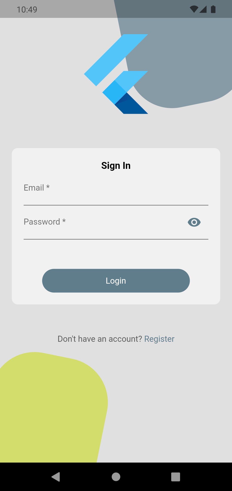
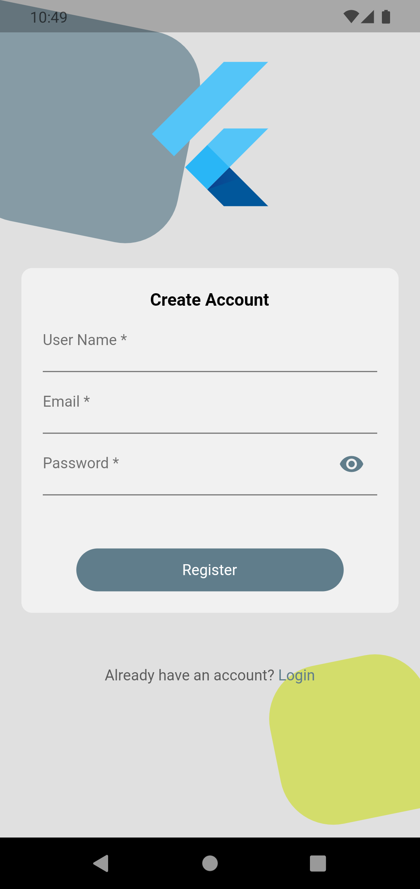
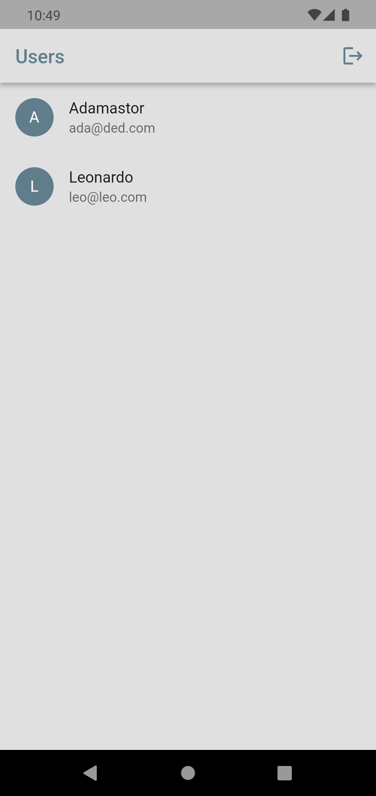

# Flutter Seva Auth






An app builded with Flutter with a simple login and register using firebase auth. With functionalities like login, register, logout and list all users from firebase firestore. The home page is a list of users with.

# Technical Architecture

### Language and Framework

The app is developed using the Flutter framework, which is a cross-platform framework that allows the development of mobile applications for Android and iOS. The language used is Dart, which is a programming language developed by Google.
Here's a brief explanation of the components that make up the technology stack in Flutter:

1. Dart Programming Language: Dart is a statically-typed, object-oriented language developed by Google. It is used to write the code for Flutter apps and provides a fast, expressive, and efficient way to build apps.
2. Flutter Framework: The Flutter framework provides the core libraries, widgets, and tools for building Flutter apps. It is designed to be fast, expressive, and highly customizable, making it easy to create beautiful and responsive user interfaces.
3. Flutter Engine: The Flutter engine is responsible for rendering the user interface, managing animations, and handling gestures. It is written in C++ and provides low-level support for the Flutter framework.
4. Flutter Widgets: Flutter provides a rich collection of pre-made widgets for building user interfaces. These widgets are designed to be fast, responsive, and customizable, and are built on top of the Flutter framework.
5. Flutter CLI: The Flutter Command Line Interface (CLI) provides tools for developing, testing, and deploying Flutter apps. It includes a number of commands for creating new projects, running apps on different devices, and other tasks.

These components work together to provide a complete solution for building high-quality, native mobile apps with Flutter.

### Architecture
 
Is used in the architecture the base of Clean Architecture, which is an architecture pattern that separates the application into different layers, each with its own responsibility, to ensure separation of concerns and maintain a clean, scalable, and maintainable codebase. The Bloc pattern is used as well. 

#### Clean Architecture


Flutter Clean Architecture is an architecture pattern that separates the application into different layers, each with its own responsibility, to ensure separation of concerns and maintain a clean, scalable, and maintainable codebase.

The clean architecture consists of several layers, starting from the core of the application, moving outward to the presentation layer. These layers are:

- Data Layer: This layer is responsible for communicating with external data sources, such as databases, APIs, or local storage. It implements the repositories defined in the domain layer and returns the data required by the use cases.
- Domain Layer: This layer contains the business logic of the application and defines the entities, use cases, and repositories that the application needs to perform its functions.
- Presentation Layer: This layer contains the user interface and is responsible for displaying data and capturing user input. It uses the entities and use cases from the domain layer to perform its functions.

##### Data Layer

In data layer is used repositories, datasources and models. To give more security to the project is used the abstraction of repositories in domain layer and the implementation repositories in data layer. The repositories are used to communicate with the data sources, and the data sources are used to communicate with the external data sources, such as databases, APIs, or local storage. The models are used to map the data from the data sources to the entities in domain layer.

##### Domain Layer

In domain layer is used entities, use cases and repositories. The entities are used to define the data that the application needs to perform its functions. The use cases are used to define the business logic of the application. The repositories are used to communicate with the data sources.

##### Presentation Layer

In presentation layer is used a Bloc pattern, which is a design pattern that allows the separation of presentation and business logic. The Bloc pattern is used to separate the presentation layer from the business logic layer. The presentation layer is responsible for displaying data and capturing user input. It uses the entities and use cases from the domain layer to perform its functions.

#### Bloc Pattern

The Bloc pattern is a design pattern that allows the separation of presentation and business logic. The Bloc pattern is used to separate the presentation layer from the business logic layer. The presentation layer is responsible for displaying data and capturing user input. It uses the entities and use cases from the domain layer to perform its functions.

In usual bloc pattern is used with Streams, but in the project is used with Cubits, which is a subset of the bloc pattern that uses Cubits instead of Streams. Cubits are similar to Streams, but they are simpler and easier to use. They are also more suitable for state management, as they only emit new states when the state changes.

And is used a BaseState, which is a class that contains the common properties of the states used in the application. The BaseState class contains the following properties:
- LoadingState: Indicates whether the application is loading data.
- ErrorState: Indicates whether an error has occurred.
- SuccessState: Indicates whether the operation was successful.
- EmptyState: Indicates whether the data is empty.

#### Dependency Injection

The dependency injection is a software design pattern that allows components of a system to be decoupled from one another, making it easier to change, test, and maintain the code.

The Get It was choosed to implement the dependency injection.


## Project Structure

```         
lib/
├───main.dart               # Entry point from the app, where main function is called.
├───bindings.dart           # Dependency injection configuration.
├───data/                   # Data layer, where all the data is fetched.
│   ├───datasources/        # Data sources, where the data is fetched from.
│   ├───models/             # Data models, where the data is mapped to and serialized from.
│   └───repositories/       # Repositories, where the data is fetched from the data sources and 
├───domain/                 # Domain layer, where the business logic is defined.
│   ├───entities/           # Entities, where the data that the application needs to perform its functions is defined.
│   ├───repositories/       # Abstract Repositories, where the data is fetched from the data sources.
│   └───usecases/           # Use cases, where the business logic of the application is defined.
├───ui/                     # Presentation layer, where the user interface is defined.
│   ├───components/         # Components, where the components of the application are defined.
│   ├───pages/              # Pages, where the pages of the application are defined.
│   └───theme/              # Theme, where the theme of the application is defined.
└───utils/                  # Utility classes and functions.

```

### Test Coverage


## Running the Project

More than one device connected.
``flutter run -d <deviceID>``

Only one device connected.
```flutter run ```

## Running Tests

Without coverage
```flutter test test/```
With coverage
```flutter test --machine --coverage > tests.output```
